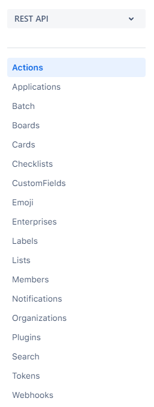

# TrelloRestApi
### Rest API project that simulates all possible features of Trello, a project management application, through the Postman tool.

#### Description:

The Rest API project called <b>TrelloRestApi</b> is a Trello test project (project management application), which simulates all possible functionalities of this project management application through the <b> Postman </b> tool as described below:

- Features of Actions; 
- Features of Applications; 
- Features of Batch; 
- Features of Boards; 
- Features of Cards; 
- Features of Checklists; 
- Features of CustomFields; 
- Features of Emoji; 
- Features of Enterprises; 
- Features of Labels; 
- Features of Lists; 
- Features of Members; 
- Features of Notifications; 
- Features of Organizations; 
- Features of Plugins; 
- Features of Search; 
- Features of Tokens; 
- Features of Webhooks. 

#### Features:

The Rest API called here <b>TrelloRestApi</b> has for each set of service classes many endpoints of the most varied types of services available.
 

Combined with the service testing tool available in endpoint format called <b>Postman</b>, the Trello API Documentation is available with all the details not only of the endpoints, but also all of Trello's extra documentation.

Each set of <b>TrelloRestApi</b> service classes has many endpoints of the most varied types of services and are divided as follows:

- **Actions**
- - [<b style="color: green;">GET</b>] Get an Action
- - [<b>PUT</b>] Update an Action
- - [<b>DEL</b>] Delete an Action
- - [<b>GET</b>] Get a specific field on an Action
- - [<b>GET</b>] Get the Board for an Action
- - [<b>GET</b>] Get the Card for an Action
- - [<b>GET</b>] Get the List for an Action
- - [<b>GET</b>] Get the Member of an Action
- - [<b>GET</b>] Get the Member Creator of an Action
- - [<b>GET</b>] Get the Organization of an Action
- - [<b>PUT</b>] Update a Comment Action
- - [<b>GET</b>] Get Action's Reactions
- - [<b>POST</b>] Create Reaction for Action
- - [<b>GET</b>] Get Action's Reaction
- - [<b>DEL</b>] Delete Action's Reaction
- - [<b>GET</b>] List Action's summary of Reactions
- **Applications**
- -  [<b>GET</b>] Get Application's compliance data
- **Batch**
- - [<b>GET</b>] Batch Requests
- **Boards**
- - [<b>GET</b>] Get Memberships of a Board
- - [<b>GET</b>] Get a Board
- - [<b>PUT</b>] Update a Board
- - [<b>DEL</b>] Delete a Board
- - [<b>GET</b>] Get a field on a Board
- - [<b>GET</b>] Get Actions of a Board
- - [<b>GET</b>] Get a Card on a Board
- - [<b>GET</b>] Get boardStars on a Board
- - [<b>GET</b>] Get Checklists on a Board
- - [<b>GET</b>] Get Cards on a Board
- - [<b>GET</b>] Get filtered Cards on a Board
- - [<b>GET</b>] Get Custom Fields for Board
- - [<b>GET</b>] Get Labels on a Board
- - [<b>POST</b>] Create a Label on a Board
- - [<b>GET</b>] Get Lists on a Board
- - [<b>POST</b>] Create a List on a Board
- - [<b>GET</b>] Get filtered Lists on a Board
- - [<b>GET</b>] Get the Members of a Board
- - [<b>PUT</b>] Invite Member to Board via email
- - [<b>PUT</b>] Add a Member to a Board
- - [<b>DEL</b>] Remove Member from Board
- - [<b>PUT</b>] Update Membership of Member on a Board
- - [<b>PUT</b>] Update emailPosition Pref on a Board
- - [<b>PUT</b>] Update idEmailList Pref on a Board
- - [<b>PUT</b>] Update showListGuide Pref on a Board
- - [<b>PUT</b>] Update showSidebar Pref on a Board
- - [<b>PUT</b>] Update showSidebarActivity Pref on a Board
- - [<b>PUT</b>] Update showSidebarBoardActions Pref on a Board
- - [<b>PUT</b>] Update showSidebarMembers Pref on a Board
- - [<b>POST</b>] Create a Board
- - [<b>POST</b>] Create a calendarKey for a Board
- - [<b>POST</b>] Create a emailKey for a Board
- - [<b>POST</b>] Create a Tag for a Board
- - [<b>POST</b>] Mark Board as viewed
- - [<b>GET</b>] Get Enabled Power-Ups on Board
- - [<b>POST</b>] Enable a Power-Up on a Board {Deprecated}
- - [<b>DEL</b>] Disable a Power-Up on a Board {Deprecated}
- - [<b>GET</b>] Get Power-Ups on a Board
- **Cards**
- - [<b>POST</b>] Create a new Card
- - [<b>GET</b>] Get a Card
- - [<b>PUT</b>] Update a Card
- - [<b>DEL</b>] Delete a Card
- - [<b>GET</b>] Get a field on a Card
- - [<b>GET</b>] Get Actions on a Card
- - [<b>GET</b>] Get Attachments on a Card
- - [<b>POST</b>] Create Attachment On Card
- - [<b>GET</b>] Get an Attachment on a Card
- - [<b>DEL</b>] Delete an Attachment on a Card
- - [<b>GET</b>] Get the Board the Card is on
- - [<b>GET</b>] Get checkItems on a Card
- - [<b>GET</b>] Get Checklists on a Card
- - [<b>POST</b>] Create Checklist on a Card
- - [<b>GET</b>] Get checkItem on a Card
- - [<b>PUT</b>] Update a checkItem on a Card
- - [<b>DEL</b>] Delete checkItem on a Card
- - [<b>GET</b>] Get the List of a Card
- - [<b>GET</b>] Get the Members of a Card
- - [<b>GET</b>] Get Members who have voted on a Card
- - [<b>POST</b>] Add Member vote to Card
- - [<b>GET</b>] Get pluginData on a Card
- - [<b>GET</b>] Get Stickers on a Card
- - [<b>POST</b>] Add a Sticker to a Card
- - [<b>GET</b>] Get a Sticker on a Card
- - [<b>PUT</b>] Update a Sticker on a Card
- - [<b>DEL</b>] Delete a Sticker on a Card
- - [<b>PUT</b>] Update Comment Action on a Card
- - [<b>DEL</b>] Delete a comment on a Card
- - [<b>PUT</b>] Update Custom Field item on Card
- - [<b>PUT</b>] Update Multiple Custom Field items on Card
- - [<b>GET</b>] Get Custom Field Items for a Card
- - [<b>POST</b>] Add a new comment to a Card
- - [<b>POST</b>] Add a Label to a Card
- - [<b>POST</b>] Add a Member to a Card
- - [<b>POST</b>] Create a new Label on a Card
- - [<b>POST</b>] Mark a Card's Notifications as read
- - [<b>DEL</b>] Remove a Label from a Card
- - [<b>DEL</b>] Remove a Member from a Card
- - [<b>DEL</b>] Remove a Member's Vote on a Card
- - [<b>PUT</b>] Update Checkitem on Checklist on Card
- - [<b>DEL</b>] Delete a Checklist on a Card
- **Checklists**
- - [<b>POST</b>] Create a Checklist
- - [<b>GET</b>] Get a Checklist
- - [<b>PUT</b>] Update a Checklist
- - [<b>DEL</b>] Delete a Checklist
- - [<b>GET</b>] Get field on a Checklist
- - [<b>PUT</b>] Update field on a Checklist
- - [<b>GET</b>] Get the Board the Checklist is on
- - [<b>GET</b>] Get the Card a Checklist is on
- - [<b>GET</b>] Get Checkitems on a Checklist
- - [<b>POST</b>] Create Checkitem on Checklist
- - [<b>GET</b>] Get a Checkitem on a Checklist
- - [<b>DEL</b>] Delete Checkitem from Checklist
- **CustomFields**
- - [<b>POST</b>] Create a new Custom Field on a Board
- - [<b>GET</b>] Get a Custom Field
- - [<b>PUT</b>] Update a Custom Field definition
- - [<b>DEL</b>] Delete a Custom Field definition
- - [<b>GET</b>] Get Options of Custom Field drop down
- - [<b>POST</b>] Add Option to Custom Field dropdown
- - [<b>GET</b>] Get Option of Custom Field dropdown
- - [<b>DEL</b>] Delete Option of Custom Field dropdown
- **Emoji**
- - [<b>GET</b>] List available Emoji
- **Enterprises**
- - [<b>GET</b>] Get an Enterprise
- - [<b>GET</b>] Get auditlog data for an Enterprise
- - [<b>GET</b>] Get Enterprise admin Members
- - [<b>GET</b>] Get signupUrl for Enterprise
- - [<b>GET</b>] Get Users of an Enterprise
- - [<b>GET</b>] Get Members of Enterprise
- - [<b>GET</b>] Get a Member of Enterprise
- - [<b>GET</b>] Get whether an organization can be transferred to an enterprise.
- - [<b>GET</b>] Get a bulk list of organizations that can be transferred to an enterprise.
- - [<b>PUT</b>] Decline enterpriseJoinRequests from one organization or a bulk list of organizations.
- - [<b>GET</b>] Get ClaimableOrganizations of an Enterprise
- - [<b>GET</b>] Get PendingOrganizations of an Enterprise
- - [<b>POST</b>] Create an auth Token for an Enterprise.
- - [<b>PUT</b>] Transfer an Organization to an Enterprise.
- - [<b>PUT</b>] Update a Member's licensed status
- - [<b>PUT</b>] Deactivate a Member of an Enterprise.
- - [<b>PUT</b>] Update Member to be admin of Enterprise
- - [<b>DEL</b>] Remove a Member as admin from Enterprise.
- - [<b>DEL</b>] Delete an Organization from an Enterprise.
- - [<b>GET</b>] Bulk accept a set of organizations to an Enterprise.
- **Labels**
- - [<b>GET</b>] Get a Label
- - [<b>PUT</b>] Update a Label
- - [<b>DEL</b>] Delete a Label
- - [<b>PUT</b>] Update a field on a label
- - [<b>POST</b>] Create a Label
- **Lists**
- - [<b>GET</b>] Get a List
- - [<b>PUT</b>] Update a List
- - [<b>POST</b>] Create a new List
- - [<b>POST</b>] Archive all Cards in List
- - [<b>POST</b>] Move all Cards in List
- - [<b>PUT</b>] Archive or unarchive a list
- - [<b>PUT</b>] Move List to Board
- - [<b>PUT</b>] Update a field on a List
- - [<b>GET</b>] Get Actions for a List
- - [<b>GET</b>] Get the Board a List is on
- - [<b>GET</b>] Get Cards in a List
- **Members**
- - [<b>GET</b>] Get a Member
- - [<b>PUT</b>] Update a Member
- - [<b>GET</b>] Get a field on a Member
- - [<b>GET</b>] Get a Member's Actions
- - [<b>GET</b>] Get Member's custom Board backgrounds
- - [<b>POST</b>] Upload new boardBackground for Member
- - [<b>GET</b>] Get a boardBackground of a Member
- - [<b>PUT</b>] Update a Member's custom Board background
- - [<b>DEL</b>] Delete a Member's custom Board background
- - [<b>GET</b>] Get a Member's boardStars
- - [<b>POST</b>] Create Star for Board
- - [<b>GET</b>] Get a boardStar of Member
- - [<b>PUT</b>] Update the position of a boardStar of Member
- - [<b>DEL</b>] Delete Star for Board
- - [<b>GET</b>] Get Boards that Member belongs to
- - [<b>GET</b>] Get Boards the Member has been invited to
- - [<b>GET</b>] Get Cards the Member is on
- - [<b>GET</b>] Get a Member's custom Board Backgrounds
- - [<b>POST</b>] Create a new custom Board Background
- - [<b>GET</b>] Get custom Board Background of Member
- - [<b>PUT</b>] Update custom Board Background of Member
- - [<b>DEL</b>] Delete custom Board Background of Member
- - [<b>GET</b>] Get a Member's customEmojis
- - [<b>POST</b>] Create custom Emoji for Member
- - [<b>GET</b>] Get a Member's custom Emoji
- - [<b>GET</b>] Get Member's custom Stickers
- - [<b>POST</b>] Create custom Sticker for Member
- - [<b>GET</b>] Get a Member's custom Sticker
- - [<b>DEL</b>] Delete a Member's custom Sticker
- - [<b>GET</b>] Get Member's Notifications
- - [<b>GET</b>] Get Member's Organizations
- - [<b>GET</b>] Get Organizations a Member has been invited to
- - [<b>GET</b>] Get Member's saved searched
- - [<b>POST</b>] Create saved Search for Member
- - [<b>GET</b>] Get a saved search
- - [<b>PUT</b>] Update a saved search
- - [<b>DEL</b>] Delete a saved search
- - [<b>GET</b>] Get Member's Tokens
- - [<b>POST</b>] Create Avatar for Member
- - [<b>POST</b>] Dismiss a message for Member
- - [<b>GET</b>] Get a Member's notification channel settings
- - [<b>PUT</b>] Update blocked notification keys of Member on a channel
- - [<b>GET</b>] Get blocked notification keys of Member on this channel
- - [<b>PUT</b>] Update blocked notification keys of Member on a channel
- - [<b>PUT</b>] Update blocked notification keys of Member on a channe
- **Notifications**
- - [<b>GET</b>] Get a Notification
- - [<b>PUT</b>] Update a Notification's read status
- - [<b>GET</b>] Get a field of a Notification
- - [<b>POST</b>] Mark all Notifications as read
- - [<b>PUT</b>] Update Notification's read status
- - [<b>GET</b>] Get the Board a Notification is on
- - [<b>GET</b>] Get the Card a Notification is on
- - [<b>GET</b>] Get the List a Notification is on
- - [<b>GET</b>] Get the Member a Notification is about (not the creator)
- - [<b>GET</b>] Get the Member who created the Notification
- - [<b>GET</b>] Get a Notification's associated Organization
- **Organizations**
- - [<b>POST</b>] Create a new Organization
- - [<b>GET</b>] Get an Organization
- - [<b>PUT</b>] Update an Organization
- - [<b>DEL</b>] Delete an Organization
- - [<b>GET</b>] Get field on Organization
- - [<b>GET</b>] Get Actions for Organization
- - [<b>GET</b>] Get Boards in an Organization
- - [<b>GET</b>] Retrieve Organization's Exports
- - [<b>POST</b>] Create Export for Organizations
- - [<b>GET</b>] Get the Members of an Organization
- - [<b>PUT</b>] Update an Organization's Members
- - [<b>GET</b>] Get Memberships of an Organization
- - [<b>GET</b>] Get a Membership of an Organization
- - [<b>GET</b>] Get the pluginData Scoped to Organization
- - [<b>GET</b>] Get Tags of an Organization
- - [<b>POST</b>] Create a Tag in Organization
- - [<b>PUT</b>] Update a Member of an Organization
- - [<b>DEL</b>] Remove a Member from an Organization
- - [<b>PUT</b>] Deactivate or reactivate a member of an Organization
- - [<b>POST</b>] Update logo for an Organization
- - [<b>DEL</b>] Delete Logo for Organization
- - [<b>DEL</b>] Remove a Member from an Organization and all Organization Boards
- - [<b>DEL</b>] Remove the associated Google Apps domain from a Workspace
- - [<b>DEL</b>] Delete the email domain restriction on who can be invited to the Workspace
- - [<b>DEL</b>] Delete an Organization's Tag
- - [<b>GET</b>] Get Organizations new billable guests
- **Plugins**
- - [<b>GET</b>] Get a Plugin
- - [<b>PUT</b>] Update a Plugin
- - [<b>POST</b>] Create a Listing for Plugin
- - [<b>GET</b>] Get Plugin's Member privacy compliance
- - [<b>PUT</b>] Updating Plugin's Listing
- **Search**
- - [<b>GET</b>] Search Trello
- - [<b>GET</b>] Search for Members
- **Tokens**
- - [<b>GET</b>] Get a Token
- - [<b>GET</b>] Get Token's Member
- - [<b>GET</b>] Get Webhooks for Token
- - [<b>POST</b>] Create Webhooks for Token
- - [<b>GET</b>] Get a Webhook belonging to a Token
- - [<b>PUT</b>] Update a Webhook created by Token
- - [<b>DEL</b>] Delete a Webhook created by Token
- - [<b>DEL</b>] Delete a Token
- **Webhooks**
- - [<b>POST</b>] Create a Webhook
- - [<b>GET</b>] Get a Webhook
- - [<b>PUT</b>] Update a Webhook
- - [<b>DEL</b>] Delete a Webhook
- - [<b>GET</b>] Get a field on a Webhook

#### Image:

#### Credits:
This project made in Postman was based on the following course:
- https://www.udemy.com/course/postman-the-complete-guide/

The API Documentation is based on the following link:
- https://developer.atlassian.com/cloud/trello/rest/api-group-actions/

About Trello and API Keys:
- https://developer.atlassian.com/cloud/trello/guides/rest-api/api-introduction/
- https://trello.com/app-key

This project was created by **Alexandre Rodrigues da Silva**.